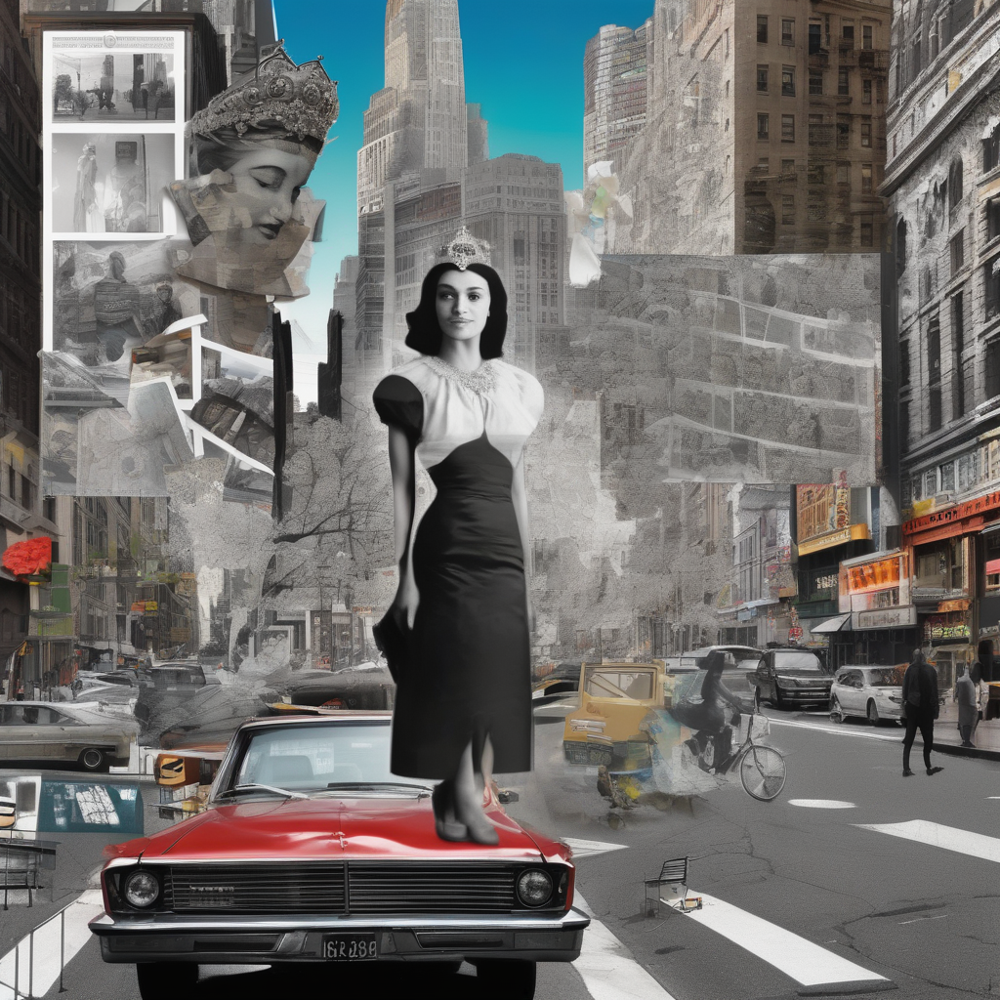
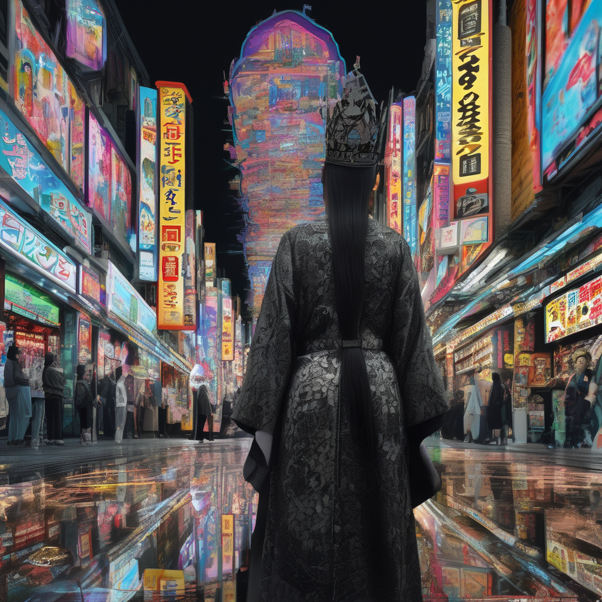
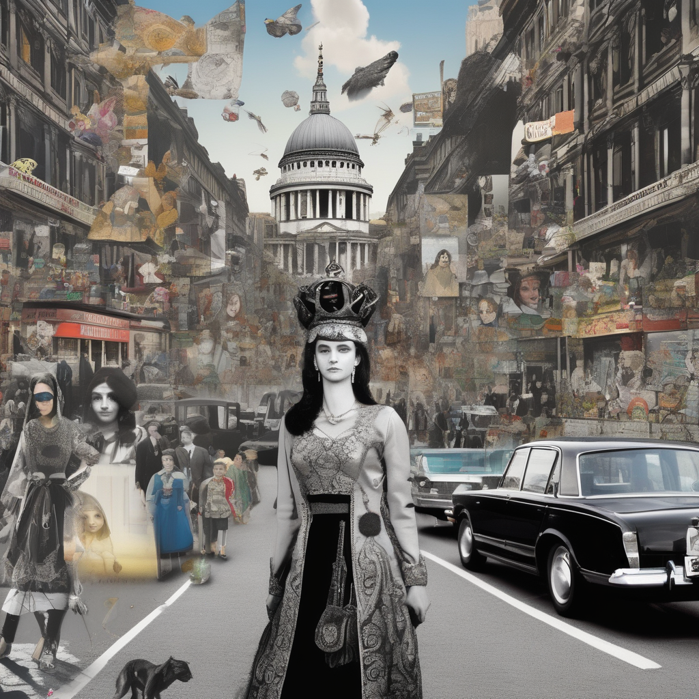

## Assignment 1 – Surrealistic Collage
### Concept
This image series explores the idea of exile and displacement across time and culture. The figures are inspired by Persian characters, removed from their original historical and cultural context and placed into modern Western urban spaces. The pictures reflect on how identity, memory, and history can feel out of place in modern spaces, like exiled bodies moving through worlds that were not made for them.

### Image 1

### Image 2

### Image 3

